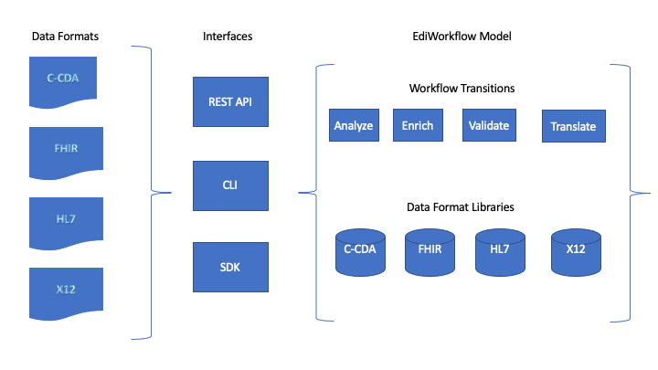

# LinuxForHealth EDI


<br>

<br>


THIS PROJECT IS ARCHIVED - Please follow https://github.com/linuxforhealth/HealthOS for current development updates.
## Overview

LinuxForHealth EDI provides a standard workflow for processing health care data regardless of format. 



LinuxForHealth EDI supports multiple integration modes. Integration options include REST endpoints, CLI (command line), or direct access using the Python SDK. The EdiWorkflow delegates message operations to external libraries.

EdiWorkflow Steps Include:

| Step Name       | Description                                                                                                           | Required |
| --------------- | --------------------------------------------------------------------------------------------------------------------- | -------- |
| Analyze         | Generates an EdiMessageMetadata object for the EDI Message                                                            | Yes      |
| Enrich          | Enriches the input message with additional data using custom transformations.                                         | No       |
| Validate        | Validates the input message.                                                                                          | No       |
| Translate       | Translates the input message in a supported format to a different supported format. Example: translate HL7v2 to FHIR. | No       |


Supported formats include: 
* ASC X12 5010
* C-CDA (in progress)
* DICOM  
* HL7v2
* FHIR-R4, STU3, DTSU2

This project is currently under construction. Please refer to the [LinuxForHealth EDI Issue Board](https://github.com/LinuxForHealth/edi/issues) to review the current "to-dos" and "to-dones".

## Quickstart

### Pre-requisites
The LinuxForHealth EDI development environment relies on the following software packages:

- [git](https://git-scm.com) for project version control
- [Python 3.8 or higher](https://www.python.org/downloads/) for runtime/coding support

### Project Setup and Validation
```shell
python3 -m pip install --upgrade pip setuptools

git clone https://github.com/LinuxForHealth/edi
cd edi

python3 -m venv venv && source venv/bin/activate && python3 -m pip install --upgrade pip setuptools 
python3 -m pip install -e .[dev]
pytest
```

### CLI
```shell
# run within project root directory
cli -v -p  src/tests/resources/270.x12

```
EdiResult Output:
```json
{
    "errors": [],
    "metadata": {
        "baseMessageFormat": "TEXT",
        "checksum": "578b8f172f2039cfcc1ec4b37eb8a3976e50577fb085823abbfead071e68d1d8",
        "ediMessageFormat": "X12",
        "implementationVersions": [
            "005010X279A1"
        ],
        "messageSize": 494,
        "specificationVersion": "005010"
    },
    "metrics": {
        "analyzeTime": 0.00016999244689941406,
        "enrichTime": 0.0,
        "totalTime": 0.06444716453552246,
        "translateTime": 0.0,
        "validateTime": 0.06427717208862305
    }
}
```

### REST API
Under Development

### SDK
```python
import pprint
from edi.workflows import load_workflow_from_file

file_path = "src/tests/resources/270.x12"
edi = load_workflow_from_file(file_path)
edi_result = edi.run()
pprint.pprint(edi_result.dict())
```

prints the EdiResult
```shell
{'errors': [],
 'metadata': {'baseMessageFormat': <BaseMessageFormat.TEXT: 'TEXT'>,
              'checksum': '578b8f172f2039cfcc1ec4b37eb8a3976e50577fb085823abbfead071e68d1d8',
              'ediMessageFormat': <EdiMessageFormat.X12: 'X12'>,
              'implementationVersions': ['005010X279A1'],
              'messageSize': 494,
              'specificationVersion': '005010'},
 'metrics': {'analyzeTime': 0.00016999244689941406,
             'enrichTime': 0.0,
             'totalTime': 0.06444716453552246,
             'translateTime': 0.0,
             'validateTime': 0.06427717208862305}
```
